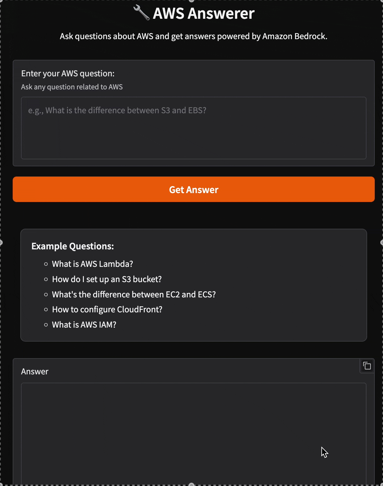

# AWS Answerer using AWS Bedrock

A Gradio web application that provides expert answers about AWS using Amazon Bedrock.

## Architecture


## Features
- The Terraform configuration deploys a Lambda function (containerized as a Docker image) that uses Amazon Bedrock to provide expert answers about AWS, along with an API Gateway endpoint for invoking the Lambda function.
- After infrastructure deployment, you can launch a local Gradio web application that automatically retrieves the API Gateway URL from Terraform outputs and provides an interactive interface for querying the Lambda function.

## Deployment

```bash
terraform -chdir=terraform init
terraform -chdir=terraform apply
```

## Launch the web application

```bash
uv run gradio ui/gradio_app.py
```



## Remove the infrastructure

```bash
terraform -chdir=terraform destroy
```