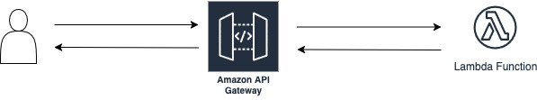

# Lambda API Gateway

This example shows how to deploy a Lambda function that checks if a word is an anagram and expose it via API Gateway.

## Architecture



## Features

- The Terraform scripts create an API Gateway endpoint that exposes the Lambda function.
- Users can send a GET request to the endpoint with a word to check if it is an anagram.
- The API Gateway uses non-proxy integration so input events and output responses can be customized.

## Deployment

```bash
terraform -chdir=terraform init
terraform -chdir=terraform apply
```

## Remove the infrastructure

```bash
terraform -chdir=terraform destroy
```