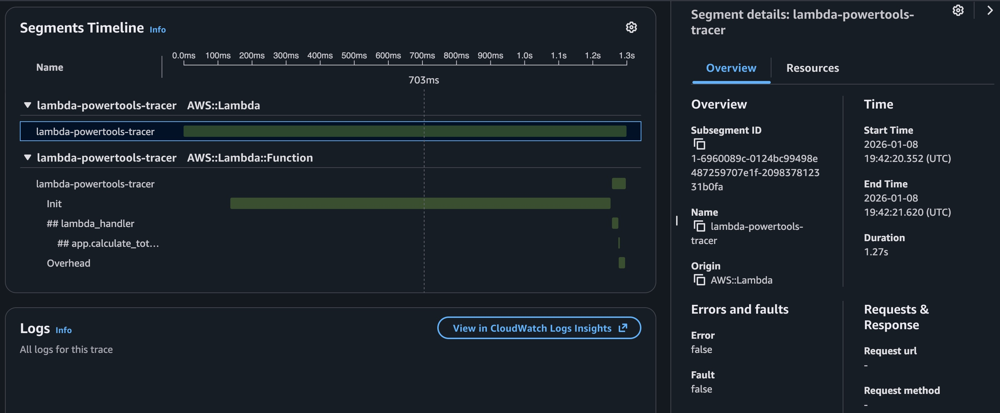

# Lambda Powertools Tracer

This example shows how to use AWS Lambda Powertools for Python to trace execution using AWS X-Ray.

## Features

- Distributed Tracing: Uses `aws-lambda-powertools` Tracer utility to capture cold starts, function execution, and method calls.
- X-Ray Integration: Visualizes the service map and traces in AWS X-Ray.
  

## Deployment

```bash
terraform -chdir=terraform init
terraform -chdir=terraform apply
```

## Remove the infrastructure

```bash
terraform -chdir=terraform destroy
```
