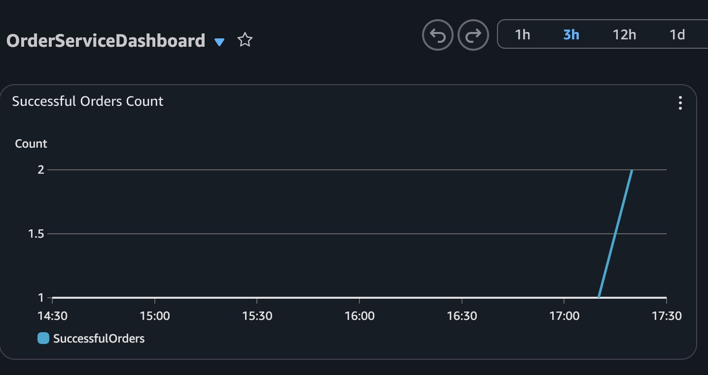

# Lambda Powertools Metrics

This example shows how to use AWS Lambda Powertools for Python to create custom CloudWatch Metrics and visualize them in a Dashboard.

## Features

- Custom Metrics: Uses `aws-lambda-powertools` Metrics utility to create business metrics (e.g., `SuccessfulOrders`).
- CloudWatch Dashboard: Automatically provisions a CloudWatch Dashboard (`OrderServiceDashboard`) to visualize the metrics.
  

## Deployment

```bash
terraform -chdir=terraform init
terraform -chdir=terraform apply
```

## Remove the infrastructure

```bash
terraform -chdir=terraform destroy
```
